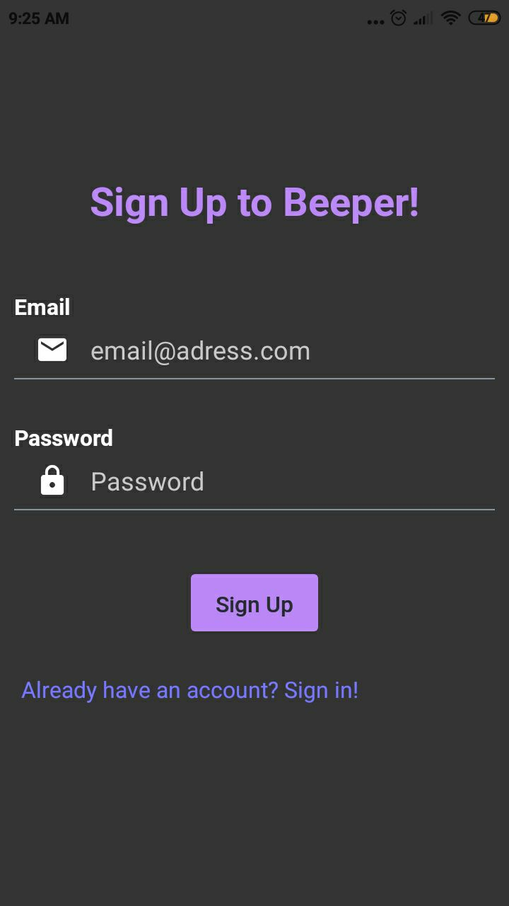
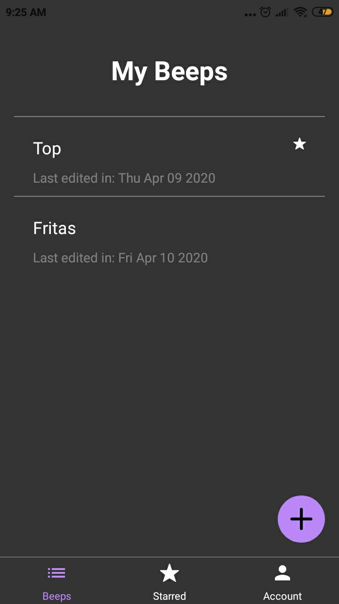
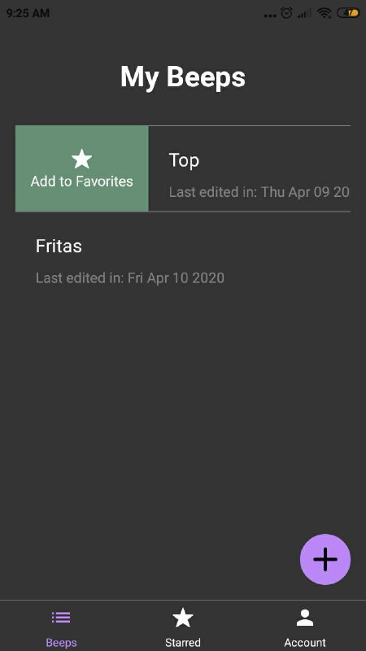
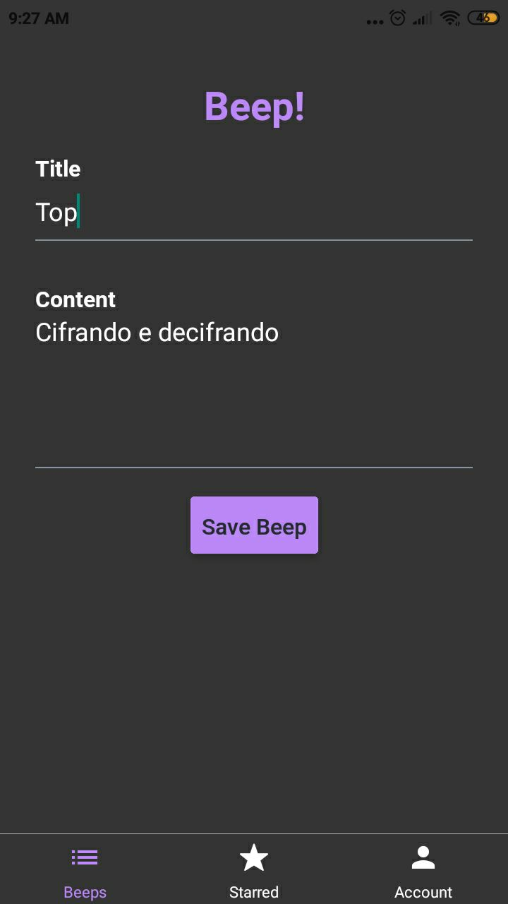

# Beeper-Client

 

  

  <h3 align="center">Beeper</h3>

  

    A React Native note-taking app. 
     

## About The Project

Beeper was a note-taking app built with React Native and MongoDB. It features creating, updating and deleting beeps, swiping to favorite and delete beeps and theming support.

This project was made as a first dive into React Native.

## Key Learnings

- State Management
- Navigation
- HOCs
- Context API and Reducers
- Theming Support
- Swipe Gestures

## Screenshots

| Sign Up                                                                         | Beep List                                                                       |
| ------------------------------------------------------------------------------- | ------------------------------------------------------------------------------- |
|  |  |

| Swipe Motion                                                                    | Edit Form                                                                       |
| ------------------------------------------------------------------------------- | ------------------------------------------------------------------------------- |
|  |  |

## License

Distributed under the MIT License. See `LICENSE` for more information.
